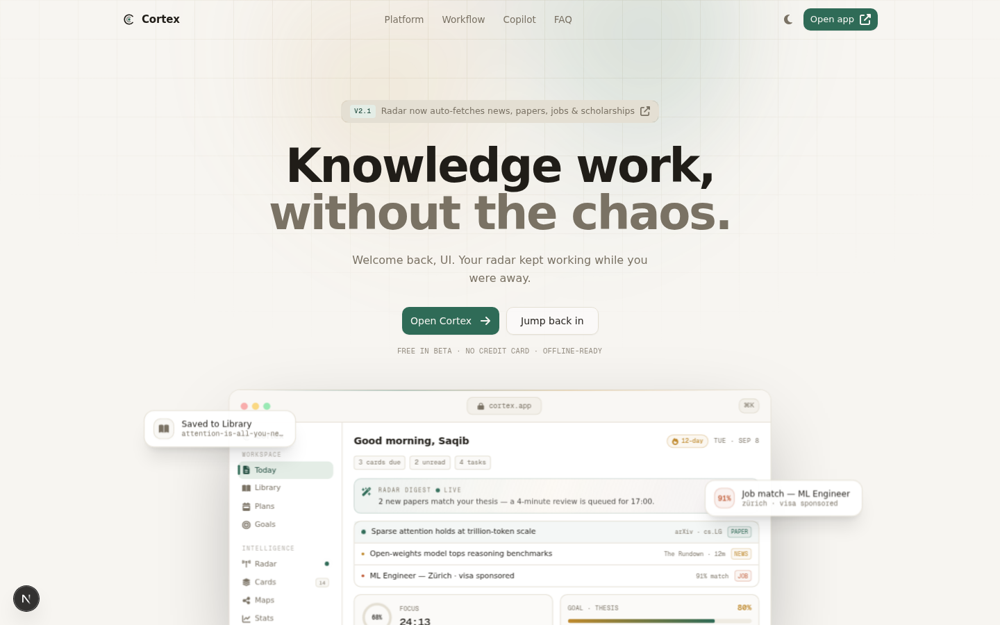
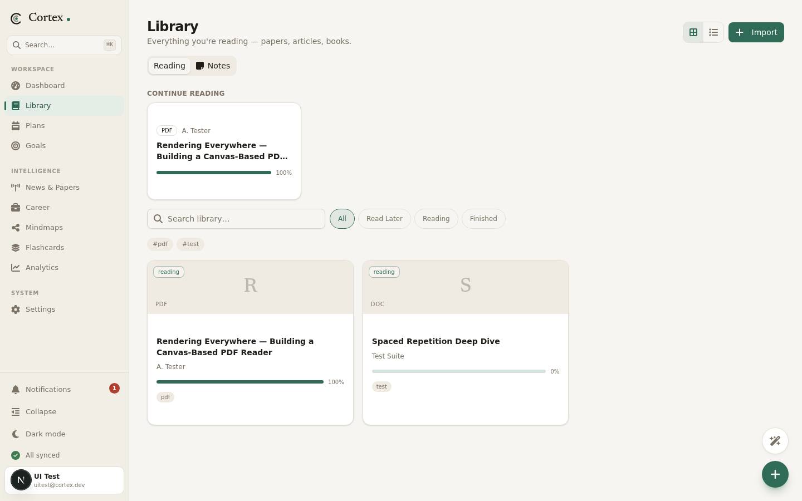
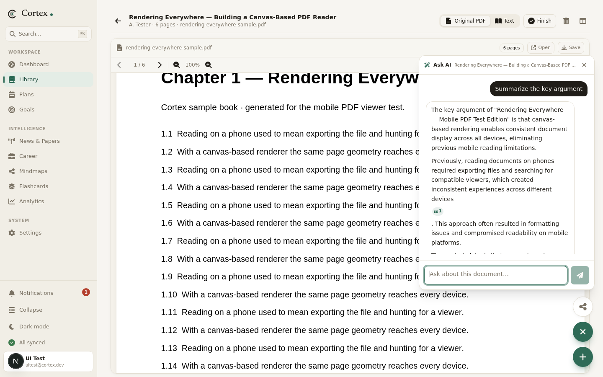
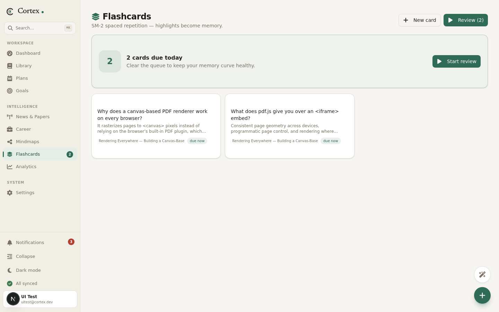
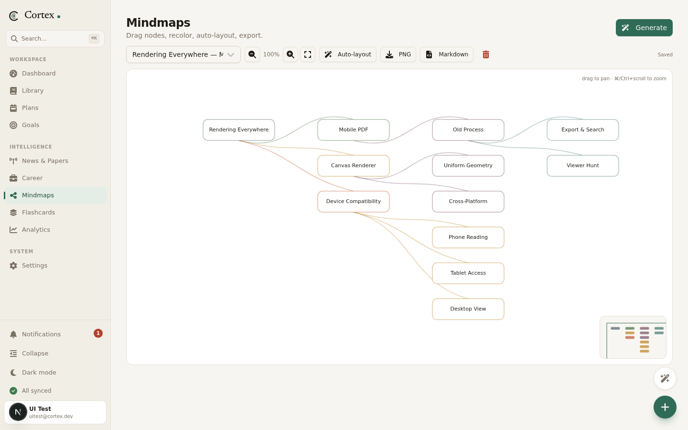
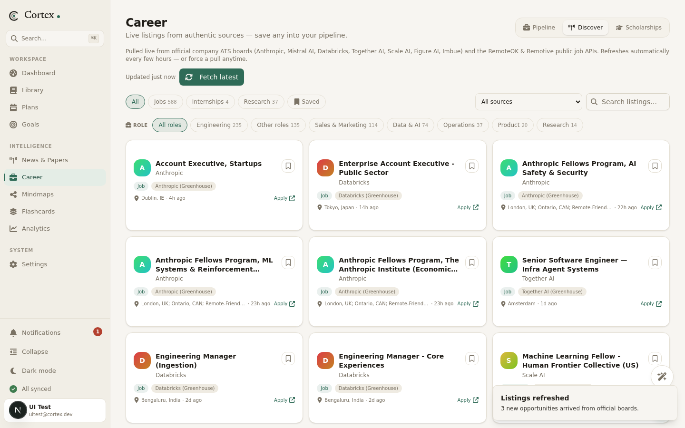
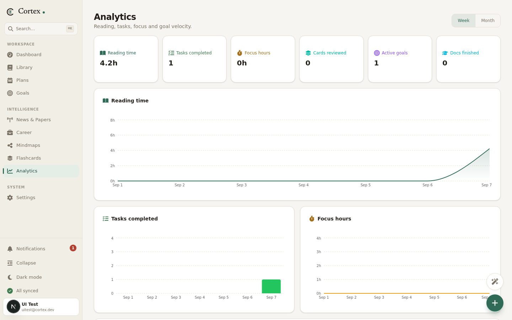
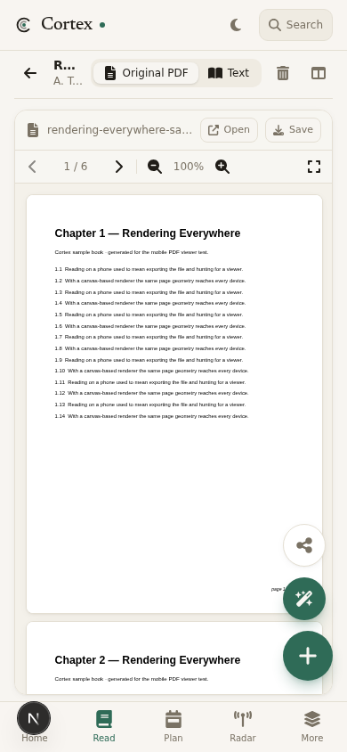

# Cortex


Cortex is a personal knowledge and productivity workspace. Reading, planning, review and career tracking live in one place — and each part feeds the next: what you read becomes highlights, highlights become flashcards, documents become mindmaps, and plans point at goals you actually care about.



## Why it exists

Knowledge work falls apart across tools. Papers live in one app, notes in another, plans in a spreadsheet, job applications in an inbox — every tool does one thing well and nothing talks to anything else. The cost is not the switching, it is the lost connections: the paper you read never becomes the flashcard you review, and the plan you make never points at the goal it serves.

Cortex is one workspace built around those connections. Everything below starts with the problem it solves, then how it is built.

---

## The daily dashboard

**Problem:** opening a laptop should answer *"what should I do right now?"* in seconds, not after clicking through five apps.

The dashboard opens with a briefing — flashcards due, unread stories, today's tasks — then the day itself: a timeline of scheduled tasks, the single **next best task** picked from what is due, active goals with computed progress, a news digest, and everything due within seven days. It reads the rest of the workspace so you do not have to.


## Reading — library and reader

**Problem:** PDFs on mobile are broken (browsers have no native viewer), and reading position never follows you between devices.

The library holds everything you read. Import happens three ways: pick a local file, paste a URL (an arXiv link like `arxiv.org/pdf/1706.03762` is fetched as a binary and stored properly), or paste raw text. The reader renders PDFs with pdf.js on a `<canvas>` — pixels, not iframes — so page geometry is identical on every device, including phones where the canvas stretches to fill the screen.




How the details are handled:

- **Resume everywhere.** The exact page is saved to `localStorage` instantly (same-device resume) and to the database debounced (cross-device resume). Reopening a book puts you back on the page, not at the top.
- **Immersive fullscreen.** One click hides the app chrome; the in-canvas toolbar keeps zoom, page navigation and the AI toggle. Esc minimizes the chat first, then exits fullscreen.
- **Text mode.** For anything with extracted text, the same document can be read as a clean typographic column with scroll-based progress — useful for articles and pasted content.

## Ask the document

**Problem:** AI answers about a paper are worthless if you cannot verify them against the source.

The reader carries a chat panel that answers strictly from the document's extracted text. Every claim gets a numbered citation chip; clicking one jumps the PDF to the exact page the answer came from — the viewer flips to `original` mode and scrolls there. The same chat stays available in fullscreen as a floating popup, so fact-checking never breaks the reading flow.



Documents also get an AI summary with key takeaways, generated from the extracted text.

## Highlights become flashcards

**Problem:** rereading feels productive and isn't. Memory needs retrieval practice, and making cards by hand is enough friction that nobody does it.

Select any passage in the reader, pick a highlight color, and tap *Flashcard* — the AI writes the question and answer from the selected text. Review uses **SM-2**, the spaced-repetition algorithm behind Anki: each card gets an ease factor and an interval, due cards queue up daily, and honest grading ("again" through "easy") reschedules them. Cards keep a link back to the document and highlight they came from.



## Mindmaps

**Problem:** after twenty pages you have the pieces but not the shape of the argument.

Any document, topic, or your collected notes can be turned into a mindmap: the AI returns a labeled tree, which is laid out automatically as a horizontal tree on an editable canvas — drag nodes, recolor branches, auto-layout, export to PNG or Markdown. Mindmaps can also absorb highlights and document references as linked nodes.

One map per document: regenerating a map for a document that already has one returns the existing map instead of silently creating a duplicate (enforced in the database by a `sourceDocId` link, so rapid double-clicks cannot create copies).



## Plans and goals

**Problem:** plans drift when they point at nothing, and progress that is typed in by hand is a wish, not a measurement.

Plans nest from year down to day with an outline view and a Kanban board, plus starter templates. A plan can be linked to a goal — "linear algebra in October" points at "ML/DL architect role by 2027" — and the goal's progress ring is *computed* from its milestones and the tasks underneath them, never entered manually. The week strip and the dashboard timeline keep the near term visible.


## Radar — news and papers

**Problem:** the field moves faster than tab-hoarding can track, and a feed you can't trust is noise.

Radar aggregates real sources — no seed data. News pulls live RSS from OpenAI, Google DeepMind, Hugging Face, Microsoft Research, NVIDIA, TechCrunch AI, TLDR AI, Import AI and Ahead of AI, with source and time filters and a saved list. Papers fetch from arXiv and the Hugging Face daily list; for any paper, the AI writes a structured breakdown: the problem it solves, what is actually new, key results, and why it matters.


## Career

**Problem:** a job search is a pipeline, not a bookmark folder — and good roles are scattered across dozens of ATS boards nobody checks daily.

Three tabs. *Discover* pulls live jobs, internships and research positions from official company boards (Anthropic, Mistral AI, Databricks, Together AI, Scale AI, Figure AI, Imbue via the Greenhouse/Lever public APIs) plus the RemoteOK and Remotive APIs — every card links straight to the real posting, filterable by type, source and role family. A *Scholarships* tab aggregates masters/PhD funding feeds the same way. Anything interesting is saved into the *Pipeline* Kanban (saved → applied → interview → offer) in one click, and pasting a job email lets the AI extract company, role and deadline into a structured entry. Gmail import runs through real Google OAuth — your email goes through your own Google project.



## Analytics

**Problem:** without honest feedback, you optimize what feels productive instead of what is.

Analytics charts reading time, tasks completed, focus hours, cards reviewed and goal velocity (milestones completed per week) over the week or month — all computed from real sessions: opening a book logs reading time, the Pomodoro timer logs focus, reviews log cards.



## The rest of the loop

- **Quick capture** from anywhere — the plus button on every screen takes a note, task or link before the thought evaporates; items land in the inbox for triage.
- **Command bar** (`Ctrl/Cmd+K`) to jump to any document, view or action.
- **Copilot dock** with suggested questions on every screen; inside a book, the Copilot icon becomes the reader's own chat.
- **Focus timer** — a Pomodoro that logs sessions against tasks, feeding the focus chart.
- **Export** — full JSON, per-document Markdown and PDF.
- **Dark mode** — the same warm paper palette, rebuilt for the dark, not an inverted afterthought.


## Mobile

The workspace reflows for phones: bottom tab bar, a floating action stack (mindmap, AI chat, quick capture) that follows you into the reader, and a PDF canvas that fills the screen down to the tab bar.



---

## Under the hood

| Choice | Why |
| --- | --- |
| Next.js 16 (App Router) + React 19 + TypeScript | One app for UI and API — no separate backend to deploy or keep in sync |
| Prisma + SQLite | Zero-setup persistence; every table carries an owner id, every query is scoped by the signed-in session |
| Tailwind CSS 4 + shadcn/ui | A warm paper-toned design system with a single green accent, built on accessible primitives |
| z-ai-web-dev-sdk | Document chat, summaries, paper breakdowns, flashcard writing, mindmap generation |
| pdf.js (`<canvas>` rendering) | Consistent PDF geometry on every browser, including mobile ones with no native viewer |
| rss-parser + pdf-parse | Real RSS aggregation and text extraction — the unglamorous workhorses |
| SM-2 scheduler (`src/lib/sm2.ts`) | The proven Anki algorithm, not a homegrown scoring scheme |
| Recharts, @dnd-kit, Font Awesome | Charts, drag-and-drop and the icon set, without hand-rolling any of them |

**Per-user isolation.** Every account is a fully isolated workspace. Documents, highlights, goals, tasks, plans, notes, the news feed, saved papers, flashcards, the career pipeline, mindmaps, focus sessions, even the fetched job listings — each table carries an owner id and every query is scoped by the signed-in session. Fetching news or papers as a new user builds *your* feed from the same live sources without touching anyone else's read/saved state. Deleting an account cascades its data.

## Running it locally

You need Node.js 20+ (or Bun — there is a `bun.lock` in the repo) and nothing else. No Postgres, no Redis, no Docker.

```bash
git clone https://github.com/SaqibMehdi123/Cortex.git
cd Cortex

# install dependencies
npm install        # or: bun install

# set up the database (SQLite, created on the spot)
cp .env.example .env
npx prisma db push

# run it
npm run dev        # or: bun run dev
```

Open http://localhost:3000. You land on the signup page — create an account and the workspace is yours alone. It starts completely empty on purpose: no demo content, no "Welcome, John Doe". Import a paper, set a goal, and it builds from there.

**Email verification and password reset.** New signups get a 6-digit code by email before the account is activated (10-minute expiry, 5 wrong attempts lock the code, one code per minute). Forgot your password? The sign-in page links to a reset flow that emails a fresh code and lets you pick a new password. On a machine with no mail server the code appears in the UI and the server log, clearly labelled as a dev fallback. To send real mail, add SMTP to `.env`:

```dotenv
SMTP_HOST=smtp.gmail.com
SMTP_PORT=587
SMTP_USER=you@gmail.com
SMTP_PASS=your-app-password
MAIL_FROM="Cortex <you@gmail.com>"
```

**Session secret.** Development works without it, but if you deploy Cortex anywhere, set `AUTH_SECRET` in `.env` (for example `openssl rand -base64 32`) so session cookies are signed with your own key.

**Optional: Google integrations.** Gmail import and Calendar sync need OAuth credentials of your own — deliberate, since your email should flow through *your* Google project:

1. Create a project at [Google Cloud Console](https://console.cloud.google.com), enable the **Gmail API** and **Calendar API**
2. Create OAuth credentials (web application) with the redirect URI `http://localhost:3000/api/auth/google/callback`
3. Fill in `GOOGLE_CLIENT_ID`, `GOOGLE_CLIENT_SECRET` and `GOOGLE_REDIRECT_URI` in `.env`

Everything else works without any keys.

## Project structure

```
src/
├── app/
│   ├── page.tsx        # public landing page (/, server-rendered)
│   ├── app/            # the workspace itself (client app under /app)
│   └── api/            # 27 route groups: documents, plans, goals, tasks,
│                       # mindmaps, flashcards, news, papers, career,
│                       # scholarships, auth, copilot, export, ...
├── components/
│   ├── views/          # one file per screen (library, reader, plans, ...)
│   ├── landing/        # landing sections (hero, features, flow, ...)
│   ├── ui/             # shadcn/ui primitives
│   ├── app-shell.tsx   # sidebar, mobile tabs, floating actions, layout
│   ├── pdf-viewer.tsx  # pdf.js canvas renderer (zoom, nav, fullscreen)
│   └── copilot-dock.tsx
└── lib/
    ├── db.ts           # Prisma client
    ├── feeds.ts        # news + scholarship sources (real RSS endpoints)
    ├── sm2.ts          # spaced-repetition scheduler
    └── store.ts        # client UI state (zustand)
```

## Where it stands

Working and used daily: PDF import (file, URL, text), the reader with resume, fullscreen and Ask-AI citations, highlight-to-flashcard with SM-2, mindmaps with per-document dedup, plans/goals linking with computed progress, live news and papers, career Discover and Pipeline with scholarships, analytics, per-user accounts with verified email, export, dark mode, and a mobile layout that is a first-class citizen.

Known rough edges, in the order they get attention: the AI features assume the Z.ai SDK is available (news, jobs and scholarships are plain HTTP and work regardless); calendar push is one-way; the career module's email classification is only as good as its parsing.

If something here sounds useful, fork it, break it, and tell me what you find.
