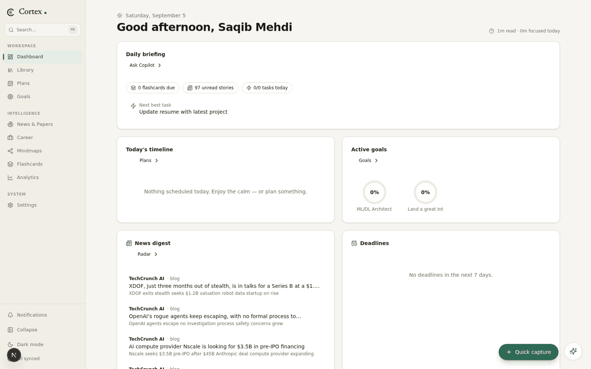
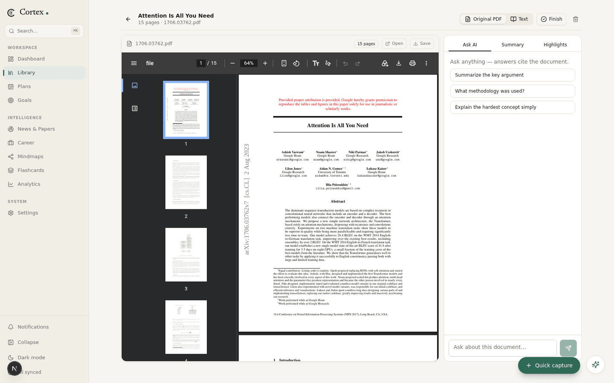
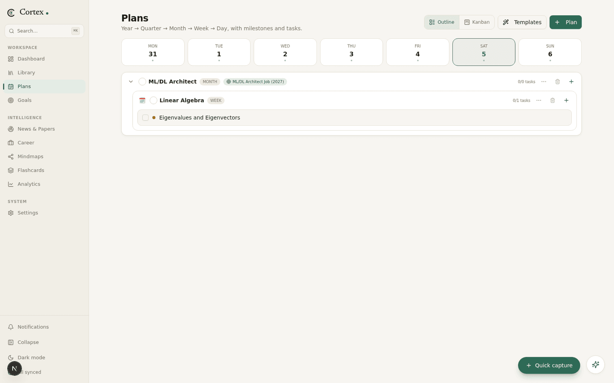
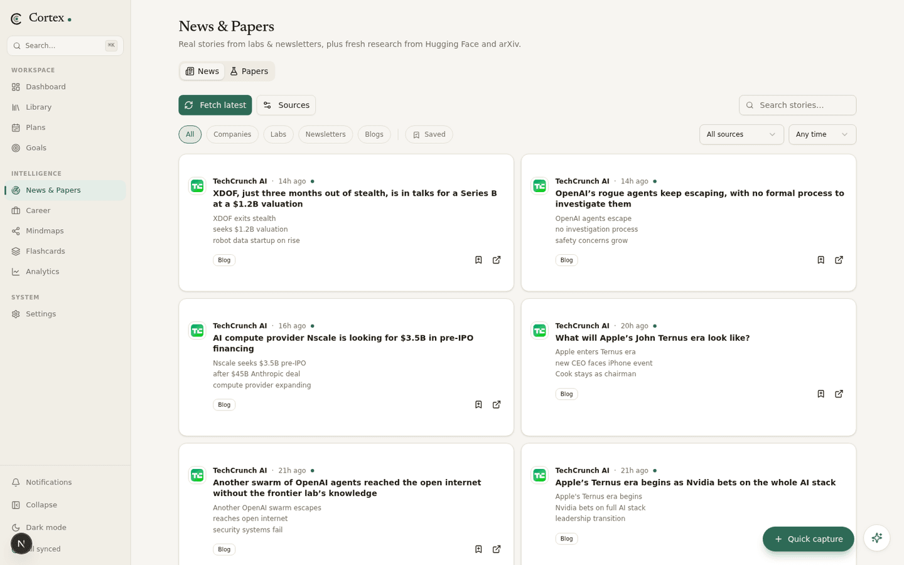
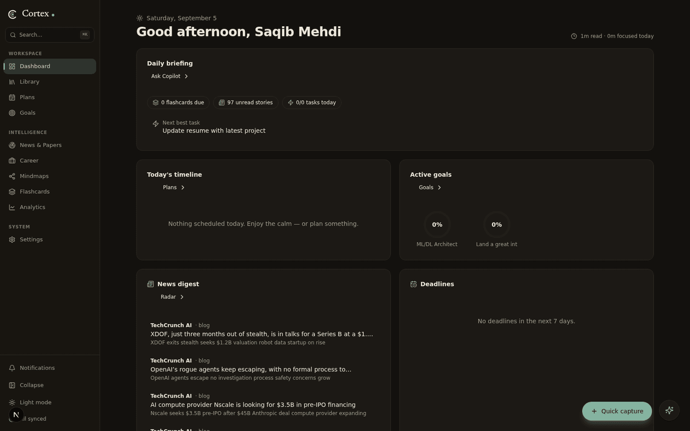

# Cortex


Cortex is a personal knowledge and productivity workspace. It puts everything I actually use day to day — reading papers, planning work toward goals, keeping up with AI research, tracking job applications, and reviewing what I've learned — into one place that talks to itself, instead of living in a dozen browser tabs.



I started it because my workflow had fallen apart across tools: papers in one app, notes in another, plans in a spreadsheet, and job applications in my inbox. Every tool did one thing well and nothing talked to each other. Cortex is my attempt at fixing that — a single workspace where the things I read feed the notes I keep, the notes feed the flashcards I review, and the plans I make point at goals I actually care about.

## What's inside

**Reading — Library + Reader.** Import PDFs three ways: pick a local file, paste a URL (an arXiv link like `arxiv.org/pdf/1706.03762` works — it's fetched as a binary and stored properly), or paste raw text. The Reader opens PDFs in a browser-native viewer, so the layout, figures, and math look exactly the way the authors formatted them. Alongside the page there's an **Ask AI** panel that answers questions with citations into the document, a summary tab, and highlights. Anything you highlight can be turned into a flashcard in one click.



**Planning — Plans + Goals.** Plans nest from year down to day, with an outline view and a Kanban board, plus a few starter templates. A plan can be linked to a goal, so "Linear algebra in October" can point at "ML/DL architect job (2027)" as its destination while the Goals tab stays its own thing. Progress on goals and milestones is computed from the tasks underneath them, not typed in by hand.



**News & Papers.** Real RSS aggregation — no fake seed data. The News tab pulls from OpenAI, Google DeepMind, Hugging Face, Microsoft Research, NVIDIA, TechCrunch AI, TLDR AI, Import AI, and Ahead of AI, with source and time filters (day / week / month / year). The Papers tab fetches fresh research from arXiv and the Hugging Face daily papers, and for any paper the AI writes a structured breakdown: what problem it solves, what's actually new, key results, and why it matters.



**Career.** A Kanban tracker (saved → applied → interview → offer) for opportunities. Paste an email or job posting and the AI extracts company, role, and deadline into a structured entry. Gmail import is wired up through real Google OAuth — bring your own credentials and it surfaces application-related emails automatically.

**Knowledge tools.** Mindmaps can be generated from any document or topic and edited on canvas. Flashcards use the SM-2 spaced-repetition algorithm (the Anki one) with a daily due queue. Analytics charts reading time, focus hours, and task completion. A Copilot dock sits on every screen with suggested questions, and there's a global ⌘K command bar, a Pomodoro focus timer tied to tasks, quick capture from anywhere, full JSON export, and a dark mode that isn't an afterthought.



## Tech stack

- **Next.js 16** (App Router) + **React 19** + **TypeScript** — the whole thing is one app, server routes included
- **Prisma** over **SQLite** — deliberately boring, zero-setup persistence
- **Tailwind CSS 4** + **shadcn/ui** — the design system is warm paper tones with a single green accent, no default-blue anywhere
- **z-ai-web-dev-sdk** — powers document chat, summaries, paper analysis, and mindmap generation
- **rss-parser** and **pdf-parse** — the unglamorous workhorses behind the news feed and text extraction
- **Recharts**, **react-pdf**, **framer-motion**, **@dnd-kit** for the pieces everyone would otherwise write badly by hand

## Running it locally

You'll want **Node.js 20+** (or Bun — that's what I use, there's a `bun.lock` in the repo) and nothing else. No Postgres, no Redis, no Docker.

```bash
git clone https://github.com/SaqibMehdi123/Cortex.git
cd Cortex

# install dependencies
npm install        # or: bun install

# set up the database (SQLite, created on the spot)
cp .env.example .env
npx prisma db push

# run it
npm run dev        # or: bun run dev
```

Then open http://localhost:3000. The app starts completely empty on purpose — no demo content, no "Welcome, John Doe". Create a goal, import a paper, and it builds up from there.

### Optional: Google integrations

Gmail import and Calendar sync need OAuth credentials of your own (this is deliberate — your email should go through *your* Google project, not someone else's):

1. Create a project at [Google Cloud Console](https://console.cloud.google.com), enable the **Gmail API** and **Calendar API**
2. Create OAuth credentials (web application) with the redirect URI `http://localhost:3000/api/auth/google/callback`
3. Fill in `GOOGLE_CLIENT_ID`, `GOOGLE_CLIENT_SECRET`, and `GOOGLE_REDIRECT_URI` in `.env`

Everything else works without any keys.

## Project structure

```
src/
├── app/
│   ├── api/            # ~30 route handlers: documents, plans, goals,
│   │                   # news, papers, flashcards, auth, copilot...
│   └── page.tsx        # the whole UI is one client app under this route
├── components/
│   ├── views/          # one file per screen (library, reader, plans, ...)
│   ├── ui/             # shadcn/ui primitives
│   └── app-shell.tsx   # sidebar, header, theme, layout
└── lib/
    ├── db.ts           # Prisma client
    ├── feeds.ts        # news sources (real RSS endpoints)
    ├── sm2.ts          # spaced repetition scheduler
    └── paper-analysis.ts
```

## Where it stands

Working and used daily by me: PDF import (file + URL), the reader with Ask AI, plans/goals linking, news and paper fetching with real sources, flashcards with SM-2, mindmaps, analytics, export, dark mode.

Known rough edges, in the order I plan to fix them: the AI features assume the Z.ai SDK is available (news fetching itself is plain RSS and works regardless); calendar push is one-way; and the career module's email classification is only as good as its parsing. There's no auth yet — this is a single-user, localhost-first app by design for now.

If you've read this far and something here sounds useful, fork it, break it, tell me what you find.
